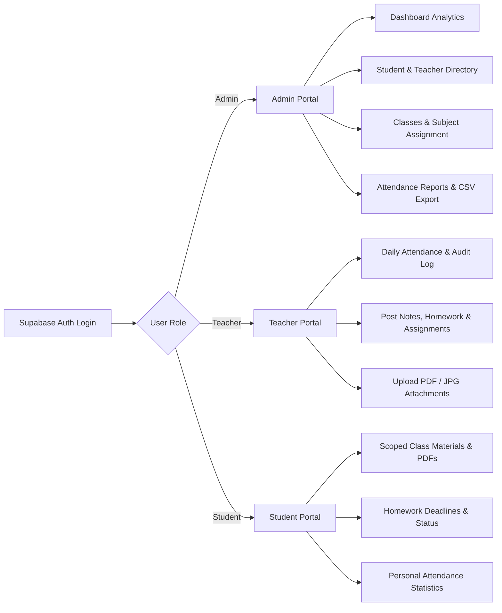

# 🏫 Greenfield School ERP — Full-Stack Management System

> A modern, responsive School ERP & Register built with **React**, **Vite**, **TailwindCSS**, and backed by a live **Supabase** backend (**PostgreSQL**, **Supabase Auth**, **Row-Level Security (RLS)**, **Storage**, and **Realtime**).

---

## 🌟 Quick Evaluation Guide for Examiners

This project is pre-configured with active test data and role-based accounts so examiners can test every workflow without manual setup.

### 🧪 Pre-Configured Test Accounts

| Role | Email | Password | Assigned Classes / Subjects | Features to Test |
| :--- | :--- | :--- | :--- | :--- |
| 👑 **Admin** | `admin@greenfield.edu` *(or your primary admin)* | `admin123` | Entire School | Manage Students, Teachers, Classes, Assign Subjects, View Reports, Export CSV |
| 🎓 **Teacher** | `rajesh.sharma@gmail.com` | `rajesh456` *(or `rajesh123`)* | Grade 1 · Mathematics | Mark Attendance, Upload Notes & Assignments (PDF/JPG) |
| 🎓 **Teacher** | `priya.nair@gmail.com` | `priya456` *(or `priya123`)* | Grade 2 · Physics | Section-scoped attendance & study materials |
| 🎓 **Teacher** | `ananya.iyer@yahoo.com` | `ananya456` *(or `ananya123`)* | Grade 1 · English | Subject teacher materials upload |
| 🎓 **Teacher** | `suresh.kumar@outlook.com` | `suresh456` *(or `suresh123`)* | Chemistry | Homeroom & subject assignment flows |
| 🎓 **Teacher** | `rojen.reji@gmail.com` | `rojen456` *(or `rojen123`)* | History & Social Studies | Multi-section management |
| 🎒 **Student** | 'aarav.stu001@school.edu' | `Pass@STU1` | Class-Specific | View scoped study notes, download PDF/JPG, attendance summary |

📊 **Live Test Data Spreadsheet:** [View Test Data & Credentials on Google Sheets](https://docs.google.com/spreadsheets/d/1ylxhLLl3o7d3IYTA2W9qPiWE7pCB5iXnmXvyXUPn1ME/edit?usp=sharing)

---

## 🚀 How to Run the Project Locally

### 1. Prerequisites
- **Node.js**: v18.0.0 or higher
- **Package Manager**: npm or yarn

### 2. Quick Start

```bash
# 1. Navigate to the project directory
cd repo

# 2. Install dependencies
npm install

# 3. Start the development server
npm run dev
```

Open [http://localhost:5173](http://localhost:5173) in your browser.

> **Note:** The `.env.local` is already configured with the live Supabase instance (`VITE_SUPABASE_URL` and `VITE_SUPABASE_ANON_KEY`).

---

## 🎯 Step-by-Step Feature Walkthrough



---

### 1. 👑 Administrator Portal (`role = 'admin'`)
Log in as the **Admin** to access project-wide management:

1. **Live Dashboard**:
   - Total enrolled students, active teachers, configured classes, and today's overall attendance rate.
   - Quick attendance status breakdown (Present, Absent, Late, Excused).
2. **Student Management**:
   - Add single students with admission number, date of birth, guardian contact, and section assignment.
   - Bulk import students using CSV upload or export full rosters.
3. **Teacher Directory**:
   - Register new teachers, assign specializations, and view assigned class sections.
4. **Class & Section Hierarchy**:
   - Create Classes (e.g., *Grade 1*, *Grade 2*) and Sections (*A*, *B*).
   - Assign **Class Homeroom Teachers** and multiple **Subject Teachers** per section.
5. **Analytics & Reports**:
   - Filter attendance by date range, grade level, and section.
   - One-click CSV report generator for administrative auditing.

---

### 2. 🎓 Teacher Portal (`role = 'teacher'`)
Log in as any teacher (e.g., `rajesh.sharma@gmail.com`):

1. **Daily Attendance Register**:
   - Switch effortlessly between assigned sections.
   - Mark attendance with interactive stamps (**P**resent, **A**bsent, **L**ate, **E**xcused).
   - Date picker to view or correct past records with an **automatic audit trail** recording who changed what and when.
2. **Notes, Homework & Assignments (New Feature ✨)**:
   - Switch to the **Notes & Assignments** tab.
   - Click **+ Post Material / Assignment**:
     - Choose target Class & Section.
     - Choose Type: **Notes / Study Material**, **Homework**, or **Assignment**.
     - Attach **PDF documents**, **JPG/PNG scans**, or Word files (up to 25MB).
     - Set submission deadlines for homework/assignments.
   - In-app file preview and secure delete capabilities.

---

### 3. 🎒 Student Portal (`role = 'student'`)
Log in as a Student to experience strict class isolation:

1. **My Class Materials & Assignments**:
   - **Automatic Privacy Isolation**: Students strictly see only the notes, homework, and assignments uploaded for their enrolled section.
   - Category filtering (**All**, **Notes**, **Homework**, **Assignments**).
   - Real-time **Due Date alerts** (Upcoming, Due Today, Past Due).
   - **In-App Viewer**: Direct embedded PDF reader and image zoom modal + download options.
2. **Profile & Attendance History**:
   - Personal attendance percentage badge (color-coded: Green ≥75%, Red <75%).
   - Chronological log of all recorded attendance days.

---

## 🔒 Security & Supabase Architecture

### Database Schema (`supabase/schema.sql`)
- **`profiles`**: Links Supabase `auth.users` to application roles (`admin`, `teacher`, `student`).
- **`teachers` & `students`**: Core identity tables with contact and enrollment details.
- **`classes` & `sections`**: Structural hierarchy with foreign keys and cascade rules.
- **`teacher_assignments`**: Many-to-many relationship mapping subject teachers to sections.
- **`attendance_records` & `attendance_audit_log`**: Double-entry attendance tracking with complete correction history.
- **`study_materials`**: Scoped notes, homework, and assignment posts with storage metadata.

### PostgreSQL Row-Level Security (RLS) Policies
- 🛡️ **Enforced at the Database Level**: Even if API calls are manipulated in the browser console, Supabase blocks unauthorized access.
- **Teachers**: Can only view and mark attendance/materials for sections they are assigned to (`public.teacher_can_access_section(section_id)`).
- **Students**: Can strictly only query records and materials matching their personal `section_id`.

### Supabase Storage
- Bucket: **`materials`** (configured for PDF, JPG, PNG, DOC assets).
- Partitioned storage paths: `{section_id}/{timestamp}_{filename}`.

---

## 📂 Project Structure

```
repo/
├── src/
│   ├── components/
│   │   ├── layout/          # AppShell, ThemeStyles (Typography & CSS Tokens)
│   │   ├── materials/       # MaterialCard, MaterialUploadModal, MaterialViewerModal
│   │   └── ui/              # Button, Input, Select, Modal, Badge, Field, EmptyState
│   ├── hooks/
│   │   ├── useAuth.jsx      # Supabase Auth state & profile listener
│   │   └── useSchoolData.js # Live data puller & Realtime subscription
│   ├── lib/
│   │   ├── queries/         # Pure Supabase query modules (auth, attendance, materials, etc.)
│   │   └── supabaseClient.js# Supabase client singleton
│   ├── pages/
│   │   ├── admin/           # DashboardPage, StudentsPage, TeachersPage, ClassesPage, ReportsPage
│   │   ├── teacher/         # TeacherHomePage (Attendance + Materials tabs)
│   │   ├── student/         # StudentHomePage (Materials + Profile/Attendance tabs)
│   │   ├── ChangePasswordPage.jsx
│   │   └── LoginPage.jsx
│   ├── utils/               # Attendance calculation & formatting helpers
│   ├── App.jsx              # Main router & role dispatcher
│   └── main.jsx             # React DOM entrypoint
├── supabase/
│   ├── schema.sql           # Complete PostgreSQL schema, RLS policies, & Storage setup
│   └── functions/           # Supabase Edge Functions for admin user creation
└── package.json
```

---

## 🛠️ Tech Stack

- **Frontend**: React 18, Vite 6, TailwindCSS, Lucide Icons
- **Backend & Auth**: Supabase (PostgreSQL 15), Supabase Auth, Supabase Storage
- **Design System**: Editorial Classical ERP styling (IBM Plex Sans, IBM Plex Mono, Source Serif 4)
- **Deployment**: Compatible with Vercel, Netlify, Cloudflare Pages
